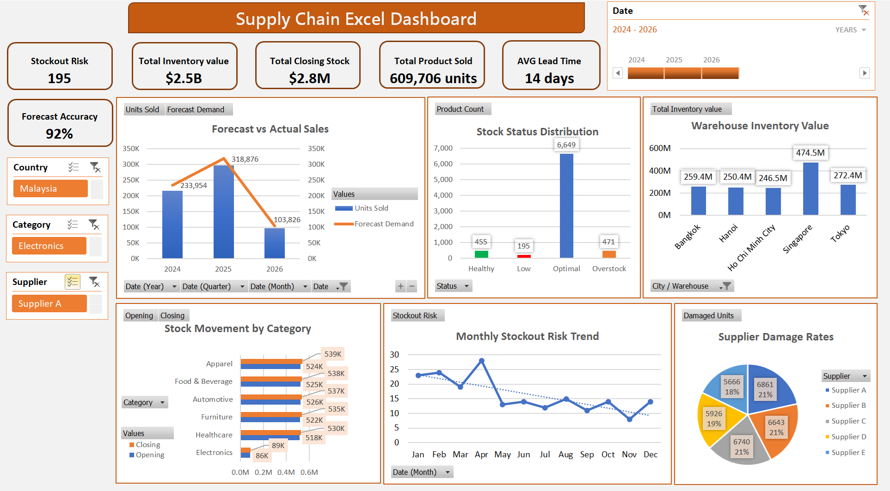

# 📊 Supply Chain Excel Dashboard

## 🔍 Project Overview

The **Supply Chain Excel Dashboard** is an end-to-end data analysis project designed to monitor, analyze, and optimize supply chain performance using Microsoft Excel.

This interactive dashboard transforms raw operational data into **actionable insights**, helping businesses improve inventory management, reduce stockouts, and evaluate supplier performance.

---

## 🎯 Business Problem

Supply chain teams often face challenges such as:
- Poor visibility of inventory across warehouses  
- Frequent stockouts or overstock situations  
- Inaccurate demand forecasting  
- Difficulty evaluating supplier performance  

👉 This dashboard addresses these issues by providing a **centralized, data-driven decision-making tool**.

---

## 🚀 Key Features

### 🎛 Interactive Controls
- Timeline filter (Year)
- Slicers for:
  - Country  
  - Product Category  
  - Supplier  

### 📌 KPI Summary Cards
- Stockout Risk  
- Total Inventory Value  
- Total Closing Stock  
- Total Products Sold  
- Average Lead Time  
- Forecast Accuracy  

---

## 📈 Dashboard Visualizations

### 1. Forecast vs Actual Sales
- Compares demand forecast with actual sales  
- Helps identify **forecast gaps and trends**

### 2. Stock Status Distribution
- Categorizes inventory into:
  - Healthy  
  - Low  
  - Optimal  
  - Overstock  
- Supports **inventory optimization decisions**

### 3. Warehouse Inventory Value
- Displays inventory value by location  
- Identifies **high-value warehouses**

### 4. Stock Movement by Category
- Compares opening vs closing stock  
- Highlights **fast-moving vs slow-moving categories**

### 5. Monthly Stockout Risk Trend
- Tracks stockout patterns over time  
- Helps in **proactive planning**

### 6. Supplier Damage Rates
- Shows percentage of damaged units by supplier  
- Enables **supplier performance evaluation**

---

## 📊 Key Insights Generated

- 📉 Forecast accuracy reached **92%**, indicating strong demand planning  
- ⚠️ **195 products at risk of stockout**, requiring immediate attention  
- 📦 High-value warehouses dominate inventory holding  
- 🔄 Some categories show **stock imbalance (overstock vs low stock)**  
- 🚚 Supplier damage rates vary significantly → opportunity for vendor improvement  

---

## 🛠 Tools & Skills Demonstrated

- Microsoft Excel  
- Pivot Tables & Pivot Charts  
- Slicers & Timeline Filters  
- Data Cleaning & Transformation  
- Data Analysis & Visualization  
- Dashboard Design Principles  
- Business Insight Generation  

---

## 💡 Business Impact

This dashboard helps organizations to:

- Improve inventory visibility across locations  
- Reduce stockout and overstock risks  
- Enhance demand forecasting accuracy  
- Optimize supplier selection  
- Support data-driven decision making  

---

## 👥 Target Users

- Supply Chain Managers  
- Inventory Analysts  
- Procurement Teams  
- Warehouse Managers  
- Business Executives  

---

## 📁 Project Structure

- `Datasets/` → Raw and processed data  
- `Dashboard/` → Excel dashboard file  
- `Images/` → Dashboard preview  
- `README.md` → Project documentation  

---

## 🔮 Future Improvements

- Inventory Turnover Ratio analysis  
- ABC Classification (Pareto Analysis)  
- Fill Rate & Service Level metrics  
- Integration with Power Query for automation  
- Power BI version of the dashboard  

---

## 📸 Dashboard Preview

---

## 📌 How to Use

1. Open the Excel dashboard file  
2. Use slicers to filter data (Year, Country, Category, Supplier)  
3. Analyze KPIs and visualizations  
4. Identify trends and make data-driven decisions  

---

## ⭐ Why This Project Matters

This project demonstrates the ability to:
- Translate business problems into data solutions  
- Build interactive dashboards  
- Generate meaningful insights from data  
- Communicate findings clearly  

👉 Ideal for **Data Analyst / Business Analyst portfolios**